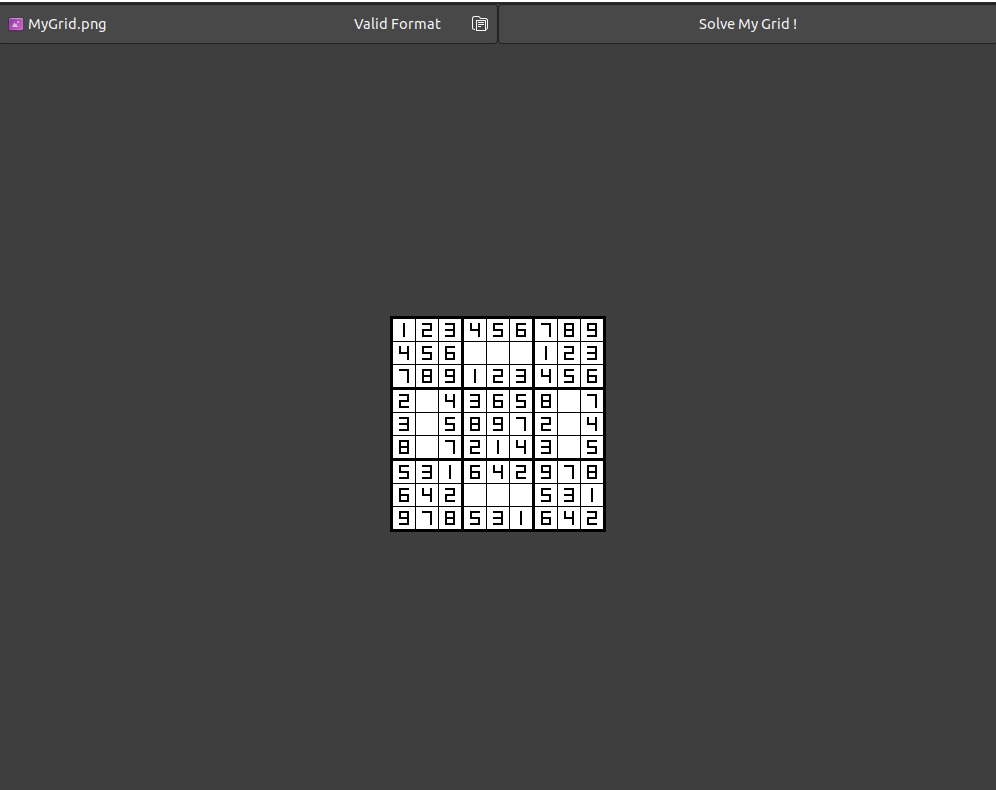

# Sudoku OCR

This repository contains the code for a project showcasing the capabilities of OCR and neural networks. The project involves recognizing digits in a Sudoku puzzle image and solving the puzzle.

## Features

- Optical character recognition (OCR) of digits in a Sudoku puzzle image
- Neural network for digit recognition
- GUI interface for testing the OCR and neural network

## Usage

To test the image processing, GUI, and neural network, run the following command in the terminal in the final folder:

    make clean all

This will clean up any files created from previous runs and create the necessary files to run the program. Then, run the file `ending` to open the GUI. The user can then select an image from the testImage folder to test.

To train the neural network, run the following commands in the terminal:

    make clean train
    ./train

Note: training the neural network may take a few minutes.
